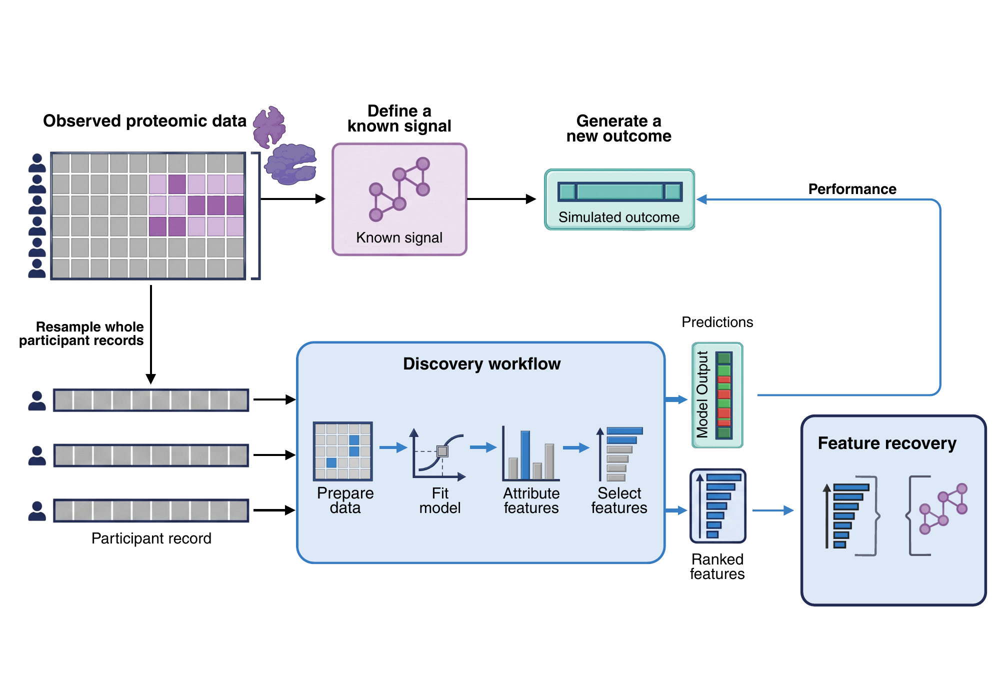

# PyPlasmode

PyPlasmode benchmarks the reliability of biomarker discovery. A model can predict disease
accurately while selecting proteins that only track the underlying signal. To evaluate its
explanations, you need a comparison in which the relevant features are known. PyPlasmode
creates that comparison by generating outcomes from specified effects within your measurements.

Use it with your existing modelling workflow: generate a dataset, fit and tune your models,
then evaluate their predictions, feature rankings or selected panels.

[](docs/methods.md)

The same generated dataset supports two comparisons: predictions against outcomes, and
selected features against the signal that generated them.

Explore the [visual gallery](docs/gallery.md) for signal patterns, correlated-feature recovery
and the five outcome families.

The [biomarker tutorial](docs/tutorial.md) follows a complete example from correlated
measurements through model fitting, attribution and recovery above chance.

## Installation

Requires Python 3.12-3.14. Install from [PyPI](https://pypi.org/project/pyplasmode/):

```bash
python -m pip install pyplasmode
```

The runtime dependencies are NumPy, SciPy and scikit-learn. To include the reference
validation and survival examples, install the validation extra:

```bash
python -m pip install "pyplasmode[validation]"
```

## Ten-minute example

```python
import numpy as np
from sklearn.linear_model import LogisticRegression
import pyplasmode as ppm

rng = np.random.default_rng(1)
population = ppm.Population(
    rng.normal(size=(2_000, 100)),
    tuple(f"protein_{index}" for index in range(100)),
)

partition = ppm.partition_population(
    population,
    training_fraction=0.6,
    validation_fraction=0.2,
    seed=7,
)
samples = ppm.generate_partitioned(
    partition,
    truth=ppm.SparseTruth(features=("protein_3", "protein_17", "protein_42")),
    outcome=ppm.BinaryOutcome(probability=0.15, odds_ratio=2.0),
    sample_sizes=ppm.PartitionSampleSizes(1_200, 400, 400),
    sampling_method="without_replacement",
    seed=42,
)

train, test = samples.training, samples.evaluation
model = LogisticRegression(max_iter=1_000).fit(train.X, train.outcome.values)
ranking = tuple(train.feature_ids[index] for index in np.argsort(-np.abs(model.coef_[0])))

recovery = ppm.evaluate_ranking(ranking, train.truth, depths=(10, 20, 50))
prediction = ppm.evaluate_prediction(
    test.outcome.values,
    model.predict_proba(test.X)[:, 1],
    metric="roc_auc",
)
print(recovery.at_depth[0].recall)
print(prediction.value)
```

Recall measures how many of the three generating features appear in the model's top ten;
AUC measures prediction on held-out participants. Repeat the comparison with different seeds
to estimate average performance and its Monte Carlo uncertainty.

Source participants are split before resampling, keeping training, validation and test
rows separate. This example uses a fixed model; the validation sample is available for
hyperparameter tuning. See [Methods](docs/methods.md) for the generation process.

## What can be varied

- **Signal:** null, sparse features, correlated groups, distributed modules, pairwise
  interactions or a custom function.
- **Outcome:** binary probability, continuous mean and spread, count rate, ordinal category
  probabilities or cumulative event risks at native-time horizons.
- **Evaluation:** feature and group recovery, weighted-module and graph-region coverage,
  signal reconstruction, prediction accuracy, panel performance and ranking stability.
  Additional functions handle tied scores, incomplete selections and matched chance references.

Start with [Methods](docs/methods.md), then choose a [signal](docs/truths.md) and
[outcome](docs/outcomes.md). The [evaluation guide](docs/evaluation.md) defines each result.
The [validation example](docs/validation.md) checks the generators and recovery metrics against
known values and reference estimators.

The executable [quickstart](https://github.com/BradSegal/PyPlasmode/blob/main/examples/quickstart.py),
[survival example](https://github.com/BradSegal/PyPlasmode/blob/main/examples/survival.py)
and [custom signal](https://github.com/BradSegal/PyPlasmode/blob/main/examples/custom_signal.py)
use synthetic inputs. The [documentation](https://bradsegal.github.io/PyPlasmode/)
includes the generation methods, evaluation definitions and API reference.

## Working with empirical data

Resampling preserves the source data's feature relationships and missingness patterns.
It can reproduce individual records, so generated datasets require the same privacy protections
as their source. See [Data handling](docs/privacy-and-limitations.md).

## Licence

PyPlasmode uses the [BSD 3-Clause License](LICENSE).
