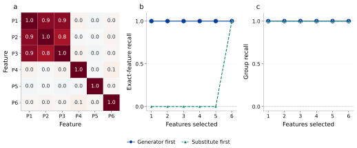
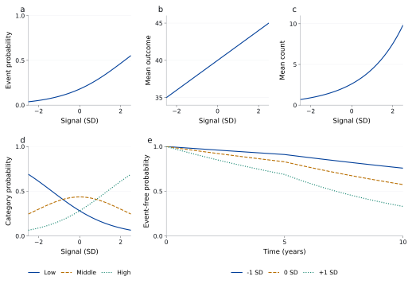

# Visual gallery

Explore how generating signals, feature relationships and outcome models shape a biomarker
benchmark. These examples use synthetic inputs and PyPlasmode's public generation and
evaluation functions.

## Different signals, the same features


Each panel evaluates a signal on the same two-feature grid. Colour and labelled contours
show the standardised generating signal: **a**, no signal; **b**, P1 alone; **c**, the sum
of P1 and P2; **d**, their product; **e**, a joint threshold requiring both features to be
positive; **f**, the custom function `tanh(P1) + 0.5*tanh(P2)`.

The sparse signal changes along one axis. The distributed signal changes with both features.
The product depends on their combination, while the threshold and custom examples introduce
abrupt and saturating responses. Use these forms to test the kinds of relationships your
method should detect. See [Generating signals](truths.md).

[PDF](assets/patterns/signal-shapes.pdf) | [SVG](assets/patterns/signal-shapes.svg) |
[Source data](assets/patterns/signal-shapes.csv)

## Finding a feature or finding its group



**a**, Pearson correlations among six features from 1,000 synthetic participants. P1 generates
the signal; P2 and P3 are correlated substitutes in the same group. **b**, exact-feature
recall and **c**, group recall for two example orders:

- **Generator first:** P1, P2, P3, P4, P5, P6.
- **Substitute first:** P2, P4, P5, P6, P3, P1.

Both orders find the relevant group immediately, but only the first finds the generating
feature immediately. Choose exact or group recovery according to what counts as a useful
discovery in your experiment. The curves are calculated with `evaluate_ranking` and
`evaluate_groups`.

[PDF](assets/patterns/correlated-recovery.pdf) | [SVG](assets/patterns/correlated-recovery.svg) |
[Correlations](assets/patterns/feature-correlations.csv) |
[Recovery data](assets/patterns/correlated-recovery.csv)

## Outcome families



The curves show the generating functions after calibration on 2,000 synthetic participants:
**a**, binary event probability; **b**, a continuous outcome's mean; **c**, expected counts;
**d**, probabilities of three ordered categories; and **e**, event-free probabilities at
signal values of -1, 0 and +1 standard deviations. Survival curves show event risk before
censoring. Each curve shows the relationship specified for generating the data.

| Outcome | Example settings |
| --- | --- |
| Binary | Marginal probability 0.20; odds ratio 2 per signal SD |
| Continuous | Mean 40; standard deviation 5; effect 2 outcome units per signal SD |
| Count | Rate 3 per unit exposure; rate ratio 1.7; conditional variance-to-mean ratio 2 |
| Ordinal | Category probabilities 0.30, 0.40 and 0.30; common odds ratio 2 |
| Survival | Cumulative event risks 0.20 at 5 years and 0.45 at 10 years; hazard ratio 2 |

Change these settings in native outcome units to represent your application. The
[outcome guide](outcomes.md) explains each family and its calibration.

[PDF](assets/patterns/outcome-families.pdf) | [SVG](assets/patterns/outcome-families.svg) |
[Source data](assets/patterns/outcome-families.csv) |
[Calibrated parameters](assets/patterns/outcome-calibration.json)

## Generate the source tables

Install PyPlasmode and download the
[gallery example](https://github.com/BradSegal/PyPlasmode/blob/main/examples/pattern_gallery.py):

```bash
python -m pip install "git+https://github.com/BradSegal/PyPlasmode.git@v1.0.0"
python pattern_gallery.py --output gallery-data
```

The script writes the tables used above. Adapt its signal and outcome settings, then use
the tables in your preferred plotting library. The supplied SVG figures are editable and
the PDFs can be used directly in presentations or teaching material.
