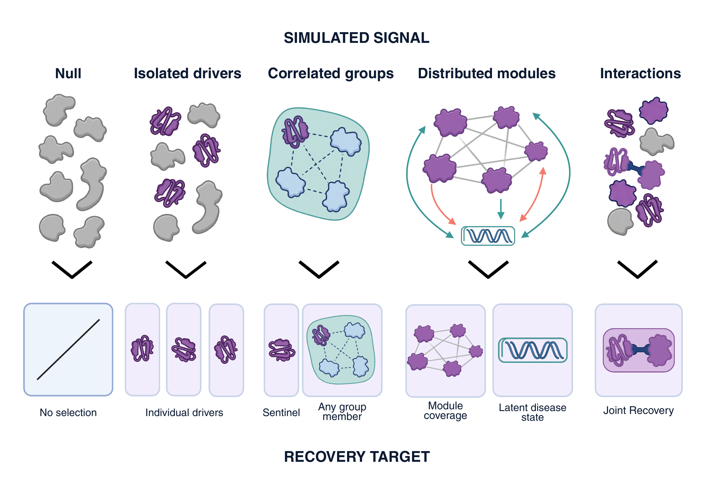

# Generating signals

A *truth specification* describes the signal to generate and the features or groups a
selection procedure should recover. Choose the form that matches the mechanism you want
to study, then pair it with an [outcome model](outcomes.md).

The diagram separates the signal you create from the object you ask the model to recover.
For a correlated group, finding a substitute and finding the actual contributor answer
different questions. For a distributed signal, coverage of its contributors and reconstruction
of its combined score are complementary. The illustrated latent state denotes that known
generating score. Under the null, no feature is a true contributor; any selected features
measure false selection. The [tutorial](tutorial.md) constructs these alternatives on
the same correlated measurements and shows the corresponding evaluations.

## Null

`NullTruth()` generates outcomes independently of the features. Use it to measure how often
a procedure selects features when no association has been added. Record the number selected
and their recurrence across runs; exact recall is undefined when there are no generating features.

## Sparse

`SparseTruth(features=(...))` combines named features with finite, non-zero weights.
`SparseTruth(count=k)` selects features automatically under a pairwise correlation threshold.
Use exact recall to measure recovery of these generating features.

## Correlated substitutes

`CorrelatedTruth` uses disjoint named `FeatureSet` groups. With the default
`signal_form="sentinels"`, one feature from each group contributes to the signal; the other
members count as substitutes. `evaluate_ranking` measures recovery of the generating
features, while `evaluate_groups` measures recovery of any member of each group.

With `signal_form="group_means"`, the signal combines within-group means. Evaluate this
distributed signal with group recovery or generating-weight coverage. It has no individual
sentinels: `direct_features` is empty and each group's `direct_feature` is `None`.

You supply the group memberships, for example from correlations or pathway annotations.
They determine which features count as substitutes in the comparison.

## Distributed module

`ModuleTruth` combines all members of a feature set with specified weights. Evaluate the
selected panel by its coverage of the absolute generating weights or its ability to
reconstruct the combined signal on held-out data.

## Pairwise interaction

`InteractionTruth` combines two features as a product or a joint threshold. Use it to study
recovery when the outcome depends on a combination of features. Interaction recovery credits
selection of both members.

## Custom signal

A `CustomTruth` function receives the resampled matrix, feature identities and a seeded
NumPy generator. Return a `CustomSignal` containing the signal, a description and its exact,
group, weighted or graph recovery targets. The
[custom-signal example](https://github.com/BradSegal/PyPlasmode/blob/main/examples/custom_signal.py)
uses a saturating relationship: increasing a feature changes the signal strongly near its
centre, but the effect flattens towards a plateau at high or low measurements. This tests a
nonlinear response without assuming that every further increase has the same effect.

Inputs are read-only, and the function should return the same finite, nonconstant signal and
targets for identical inputs and seed. PyPlasmode checks this by calling it twice.
Custom functions work with `generate`. For `generate_partitioned`, use a built-in truth
specification so the same mechanism can be applied across partitions.
