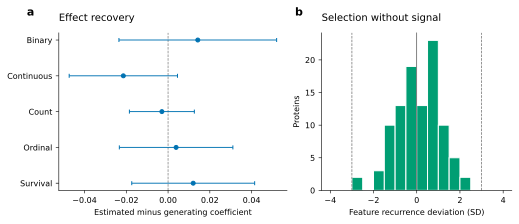

# Validation

The validation example checks outcome calibration, effect estimation and feature recovery
using synthetic data and known generating values. Install the optional estimators from
[PyPI](https://pypi.org/project/pyplasmode/), download
the [validation script](https://github.com/BradSegal/PyPlasmode/blob/main/examples/validation_vignette.py),
and run it locally:

```bash
python -m pip install "pyplasmode[validation]"
python validation_vignette.py --output validation-output
```

The output includes CSV summaries, a PDF/SVG figure and a JSON description of the simulation
design following ADEMP: aims, data-generating mechanisms, estimands, methods and performance
measures. See [Morris et al.](references.md#simulation-studies) for the framework.

## Reference run

The reference run separates three possible failures: generating the wrong outcome,
scoring a ranking incorrectly, and finding apparent structure when no signal is present.

1. **Create a population.** Generate 20,000 rows and 100 independent Gaussian features.
   These exchangeable features provide a simple reference in which no feature has an
   intrinsic selection advantage.
2. **Add a known effect.** Standardise one feature and generate binary, continuous, count,
   ordinal and survival outcomes from it. The requested effects are known before fitting.
3. **Recover the effect with another implementation.** Fit statsmodels binomial, linear,
   Poisson, ordered-logistic and Cox models. Compare their fitted coefficients and 95%
   intervals with the values supplied to PyPlasmode. This checks agreement between the
   generators and independently implemented estimators.
4. **Repeat outcome generation.** Use 40 random seeds per family and compare realised
   outcomes with the requested probabilities, rates and other native-unit targets.
5. **Check the recovery arithmetic.** Put the generating features first in a ranking, then
   compare with 1,000 random rankings. Perfect ordering should recover all contributors;
   random top-10 selections from 100 features should recover 10% on average.
6. **Remove the association.** Across 400 simulations, set the odds ratio to one and rank
   features by their association with the random outcome. Each feature should appear in
   the top ten about 40 times. This tests selection recurrence under an exchangeable null.

The figure and tables report these distinct checks, rather than combining them into one
validation score.



Blue points and 95% intervals show the difference between the statsmodels estimate and
the generating coefficient for each outcome family. Zero denotes exact agreement; ratios
are compared on their log scale. Each fit uses one simulated dataset. The histogram shows
per-feature top-10 recurrence across 400 null
simulations with exchangeable features. Dashed lines mark the expected recurrence plus or
minus three standard deviations.

A ranking that places the known generating features first achieves recall 1. Across 1,000
random rankings, mean top-10 recall was 0.1018, close to the expected 0.1 (Monte Carlo SE
0.00416). All five fitted effect intervals contained the generating coefficient. Forty
calibration replicates per outcome family completed without diagnostic failures.

Download the [effect estimates](assets/validation/external-conformance.csv),
[native-unit calibration](assets/validation/outcome-reproducibility.csv),
[ranking controls](assets/validation/truth-recovery.csv) and
[null recurrence](assets/validation/null-control.csv). The example script contains the
sample sizes, mechanisms and seeds used to generate them.

## Test suite

Unit tests cover input handling and numerical calculations. Statistical tests check
distributional properties and chance expectations. Integration tests combine sampling,
generation and evaluation across outcome families, including null signals and missing data.

| Component | Reference calculation | Additional cases |
| --- | --- | --- |
| Complete-row sampling | Source-row identity and empirical covariance | Replacement limits and separation of source rows |
| Truth construction | Linear algebra for sparse, sentinel and distributed signals | Missing or constant features and invalid specifications |
| Binary and survival effects | statsmodels Logit and PHReg | Infeasible probabilities and invalid cumulative risks |
| Continuous, ordinal and count effects | statsmodels estimators and marginal moments | Null signals, categories and varying exposures |
| NB1 dispersion | SciPy negative-binomial moments | Conditional residual variance with heterogeneous means |
| Exact recovery | Hand counts and SciPy hypergeometric expectations | Agreement between rankings and tied-score selections |
| Fractional group and interaction recovery | Combinatorial and sampled references | Ties, zero scores and invariant references |
| Stability and reconstruction | Prefix-overlap formula and standard regression | Small samples and constant targets |

Matched recovery tests compare analytic expectations with hypergeometric and sampled
references. Outcome-specificity tests compare a selection against different, disjoint signals.
Together, these exercise both known positive recovery and its chance reference.

Run the tests with `pytest` after following the
[development setup](https://github.com/BradSegal/PyPlasmode/blob/main/CONTRIBUTING.md).
